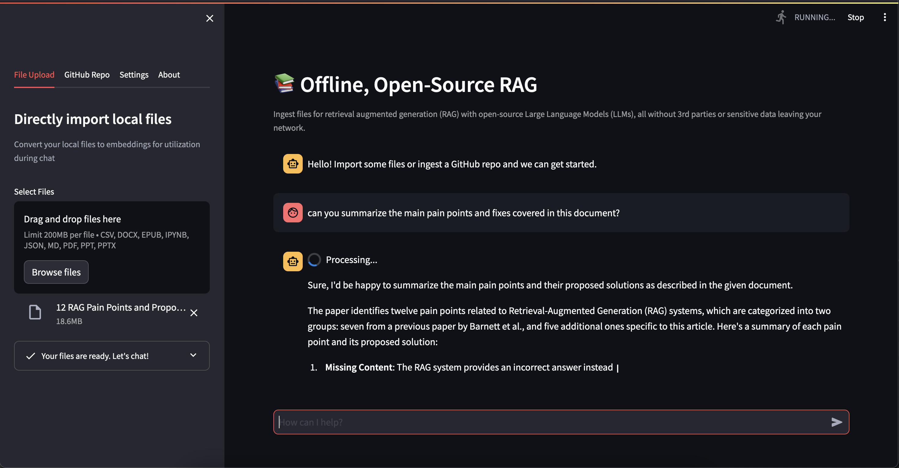

# Local RAG

📚 Offline, Open-Source RAG

Ingest files for retrieval augmented generation (RAG) with open-source Large Language Models (LLMs), all without 3rd parties or sensitive data leaving your network.

### Pre-Requisites

- A pre-existing Ollama instance
- Python 3.9+

### Getting Started

- `pip install pipenv && pipenv install`
- `pipenv shell && streamlit run main.py`

### To Do
- [x] Refactor
- [x] Migrate chat stream to llama-index
- [ ] Implement llama-index Chat Engine with memory
- [ ] Function to handle file type conversions
- [ ] Function to handle GitHub repo ingestion
- [ ] Show Loaders in UI (file uploads, conversions, ...)
- [ ] Show Stats in UI (request time, etc.)
- [ ] View and Manage Imported Files
- [ ] About Tab in Sidebar

### Resources
- [Ollama w/ llama-index](https://docs.llamaindex.ai/en/stable/examples/llm/ollama.html)
- [RAG w/ llama-index](https://blog.streamlit.io/build-a-chatbot-with-custom-data-sources-powered-by-llamaindex/)